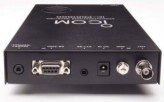

# PCRd



ICOM PCR-1000 Radio Control Software - Unix daemon and command-line interface for controlling ICOM PCR-1000 radio receiver.

## Overview

PCRd is a Unix program that provides command-line and daemon mode control of ICOM PCR-1000 radio receiver via serial port. It supports socket-based remote control, making it ideal for controlling a radio located anywhere on your network.

**Source**: This package originally came from https://www.crc.id.au/pcrd-pcr1000-on-linux/

**Note**: The original source code has been modified from the original version.

## Project Structure

- `pcrd.c` - Main source code
- `pcrd.h` - Header file with structure definitions, constants, and function prototypes
- `Makefile` - Build system with support for Linux and FreeBSD
- `LICENSE` - GNU GPL v2 license
- `README.md` - This file
- `RELEASE_NOTES.md` - Detailed version history

## Features

- **Frequency Control**: 0.05 to 1300 MHz range
- **Multiple Modes**: LSB, USB, AM, CW, NFM, WFM
- **Filter Settings**: 2.8, 6, 15, 50, 230 kHz
- **Audio Controls**: Volume and squelch (hex 00-FF)
- **Advanced Features**:
  - Automatic Gain Control (AGC) - Slow/Fast
  - Noise Blanker
  - RF Attenuator
  - IF Shift (80 is center)
- **Daemon Mode**: Background operation with network socket control
- **Status Reporting**: Signal strength, squelch state, frequency offset
- **Uptime Tracking**: Reports daemon runtime when connected

## Building

PCRd includes a Makefile with targets for multiple platforms:

```bash
make linux          # Build for Linux (release)
make debug_linux     # Build for Linux with debug symbols
make freebsd         # Build for FreeBSD (release)
make debug_freebsd   # Build for FreeBSD with debug symbols
make clean           # Remove compiled binary
```

## Usage

### Command Line Mode

Basic usage:

```bash
./pcrd <frequency> <mode> <filter>
```

Example:
```bash
./pcrd 101.700 wfm 230    # Tune to 101.7 MHz FM with 230 kHz filter
./pcrd 137.500 am 50      # Tune to 137.5 MHz AM with 50 kHz filter
```

### Command Line Options

```
-b           = Daemon Mode (Background)
-C <nnnn>    = Use alternate socket port (default: 5151)
-X           = eXit (only in Daemon Mode via socket)
-D <0-9>     = Set debugging level
-R           = Suppress radio status reporting while looping
-l           = Loop sending command to radio every 5 seconds
-i           = Initialize radio
-s <squelch> = Hex range from 00 to FF
-v <volume>  = Hex range from 00 to FF
-O           = Radio OFF
-d <port>    = Serial port (default: /dev/ttyUSB0)
-A <0|1>     = AGC (0=Off, 1=Slow)
-N <0|1>     = Noise Blanker (0=Off, 1=On)
-S <0|1>     = RF Attenuator (0=Off, 1=On)
-I <00-FF>   = IF Shift (80 is center)
```

### Serial Port Detection

The program first looks for `/dev/pcr1000` before using the default serial port (`/dev/ttyUSB0`). Create a symlink to use a specific device:

```bash
ln -s /dev/ttyUSB0 /dev/pcr1000
```

## Daemon Mode

Run as a background daemon for persistent operation:

```bash
./pcrd -b 101.700 wfm 230
```

The daemon will report its PID and start listening on port 5151 (default).

### Socket Communication

Connect via telnet or any TCP client:

```bash
telnet localhost 5151
```

Once connected, you'll see:
- Connection greeting with version and PID
- Remote host address
- Daemon uptime
- Current receiver status
- Command prompt

Send commands the same way you would on the command line (without the program name).

To exit the daemon from socket mode:
```
-X
```

### Daemon Features

- **Auto power-on**: Maintains radio power while waiting for socket commands
- **Timeout protection**: Daemon exits if radio communication is lost
- **Non-blocking I/O**: Radio continues polling while waiting for socket commands
- **Signal handling**: Clean shutdown on SIGINT, SIGTERM, SIGHUP

## Examples

### Initialize radio and tune to a frequency
```bash
./pcrd -i 146.520 nfm 15
```

### Set volume and squelch
```bash
./pcrd -v 80 -s 40 101.900 wfm 230
```

### Start daemon with debug output
```bash
./pcrd -b -D 2 101.700 wfm 230
```

### Remote control example
```bash
# Terminal 1: Start daemon
./pcrd -b 101.700 wfm 230

# Terminal 2: Connect and change frequency
telnet localhost 5151
# Once connected:
101.900 wfm 230
# Radio changes to new frequency
```

## Use Case

From the original author:

> "My radio is connected to a Linux server in the basement, where the antenna feedline enters the house. The server has a sound card installed, and is running 'Speak_freely' for UNIX (Open Source). It is running the Speak Freely 'sfreflect' reflector for streaming audio, and 'sfmike' pointed at the reflector. The output of the radio is connected to the line input of the sound card, and clients around the home network are running both Speak Freely for UNIX and Windows, so that I can listen to the radio anywhere in the house where there is a computer connected to the ethernet."

This setup allows remote audio streaming and control of the radio throughout your network.

## Version History

See [RELEASE_NOTES.md](RELEASE_NOTES.md) for detailed revision history.

## License

This program is released under the GNU General Public License Version 2. See LICENSE file for details.

## Credits

- **Original Author**: Carl Walker (cwalker@icmp.com) - Version 0.10
- **Updated to v0.12**: Steven Haigh - http://www.crc.id.au/pcrd
- **Updated to v0.13**: Code modernization, cleanup, and documentation updates
- **Original work**: pcr.c by sili@l0pht.com - http://www3.l0pht.com/~sili/pcr.html

## Support

This is legacy software maintained for historical purposes and compatibility with ICOM PCR-1000 radio receiver.
